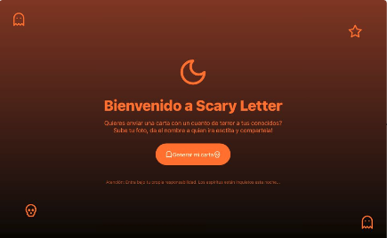

## Scary Letter / Application for Clodinary Hackathon



First, run the development server:

```bash
npm run dev
# or
yarn dev
# or
pnpm dev
# or
bun dev
```

Open [http://localhost:3000](http://localhost:3000) with your browser to see the result.

## Learn More

You can find the hackathon bases at:

- [Cloudinary CloudCreate: Spooky AI Hackathon ](https://cloudinary.com/blog/cloudinary-cloudcreate-spooky-ai-hackathon)

## Deployed project

- [Scary Letter](https://scary-stories.vercel.app/)
